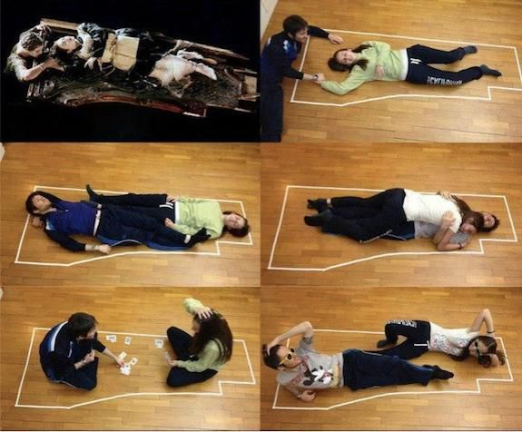

**Fecha y hora de entrega**: 30 de noviembre de 2020 a las 9 a.m.

**Fecha y hora de devolución general**: 5 de diciembre de 2020 a las 9 a.m.

## INSTRUCCIONES

Deberán realizar el trabajo en un **RNotebook** y entregarlo en formato HTML.

El **RNotebook** debe:

* Tener el siguiente nombre: eea2020_tp3_(apellido)_(nombre)
* Mostrar todo el código que escriban. NO USAR `echo=FALSE`
* Ser ordenado de acuerdo a las consignas propuestas

Una vez terminado el notebook deberán enviarlo por mail a eea.uba@gmail.com, según se indica en la guía de procedimiento.

## CRITERIOS DE EVALUACION

* Explicar los procedimientos y decisiones en el texto
* Comentar el código
* Llegar a los resultados esperados
* Recomendamos fuertemente usar las funciones de `tidyverse`
* Respetar el pipeline con los datasets de entrenamiento, validación y testeo

## DATOS

Se trabajará sobre un nuevo dataset del Titanic, obtenido en [Kaggle - Titanic: Machine Learning from Disaster](https://www.kaggle.com/c/titanic/overview). El mismo se encuentra ya particionado en subconjuntos de entrenamiento y testeo. En cada consigna se indica cuál deberán usar. 

## CONSIGNAS

En este trabajo deberán crear un modelo de regresión logística para clasificar si una persona que viajaba a bordo del Titanic sobrevivió o no.

El diccionario de datos se puede encontrar [aquí](https://www.kaggle.com/c/titanic/data)

### DATASET DE ENTRENAMIENTO:

#### 1) Preparación de datos

a) Leer el archivo *titanic_complete_train.csv* y mostrar su estructura.

b) Seleccionar las variables **PassengerId**, **Survived**, **Pclass**, **Sex**, **Age**, **SibSp**,**Parch**, **Fare** y **Embarked**.

c) Transformar las variables **Survived**,  **Pclass** y **Embarked** a factor.

d) Realizar un gráfico de `ggpairs` para las variables  **Survived**, **Pclass**, **Sex**, **Age** y **Fare** e interpretarlo.

e) Mostrar la distribución de clase (Sobrevivientes vs No Sobrevivientes).

f) Dividir al dataset en conjunto de entrenamiento (70% de los datos) y validación (30% de los datos). Volver a analizar la distribución de clase para chequear que sea aproximadamente igual entre ambos conjuntos y respecto a la distribución de clase que obtuvieron para todo el dataset en el punto 1)e).
    
NOTA: Ya hemos imputado los valores faltantes de ciertas variables en este dataset

#### 2) Predicciones 

a) Realizar un modelo de regresión logística para predecir la supervivencia en función de **Pclass**, **Sex** y **Age**. Usar solo el dataset de entrenamiento.

b) Dar una **breve interpretación** de los coeficientes y su significatividad.

c) ¿Quién tiene una mayor **probabilidad de supervivencia**? Rose que es una mujer de 17 años que viaja en primera clase o Jack que es un hombre de 20 años viajando en tercera clase.
    

  { height=7cm }{ height=7cm }

#### 3) Generación de modelos

a) Generar **3 modelos** de regresión logística sobre el dataset de entrenamiento **utilizando diferentes combinaciones de variables**. Al menos dos modelos deben ser multivariados

b) Ordenar por la **deviance** los 3 modelos creados en el punto 3)a) y el creado en el punto 2)a) y seleccionar el mejor modelo en términos de la **deviance explicada**.

#### 4) Evaluación del modelo

a) Realizar el gráfico de **curva ROC** y obtener el **AUC** para el modelo elegido. Interpretar el gráfico.

b) Realizar un **violin plot** e interpretar.

#### 5) Elección del punto corte

a) Sobre el **dataset de VALIDACIÓN** realizar un gráfico de **Accuracy, Specificity, Recall y Precision** en función del punto de corte.

b) Elegir un **punto de corte** y explicar su decisión.

c) Obtener la **matriz de confusión** con el modelo y punto de corte elegidos. Interpretarla.

### DATASET DE TESTEO:

#### 6) Evaluación del Modelo 

a) Leer el archivo *titanic_complete_test.csv* y transformar las variables **Survived**,  **Pclass** y **Embarked** a factor.

b) Con el modelo y punto de corte elegidos **clasificar** a las personas del dataset de testing.

c) Obtener la **matriz de confusión** y comparar con la obtenida en el punto 5)c).
    
